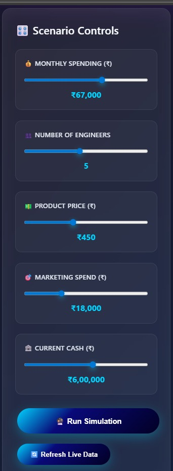
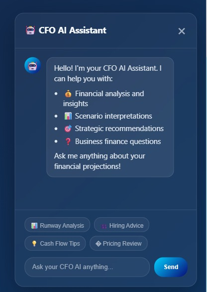
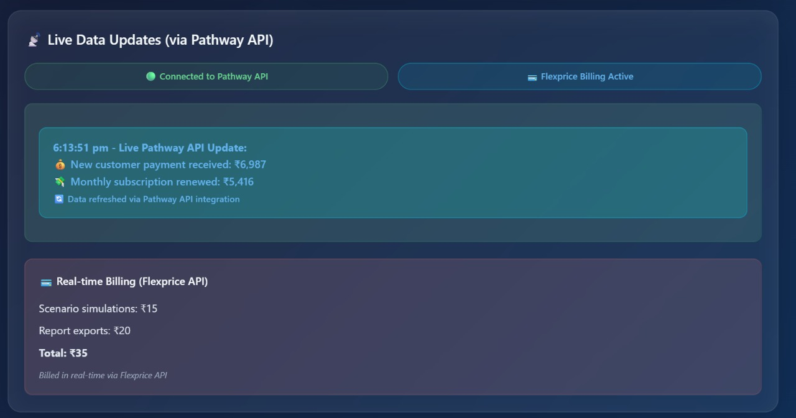
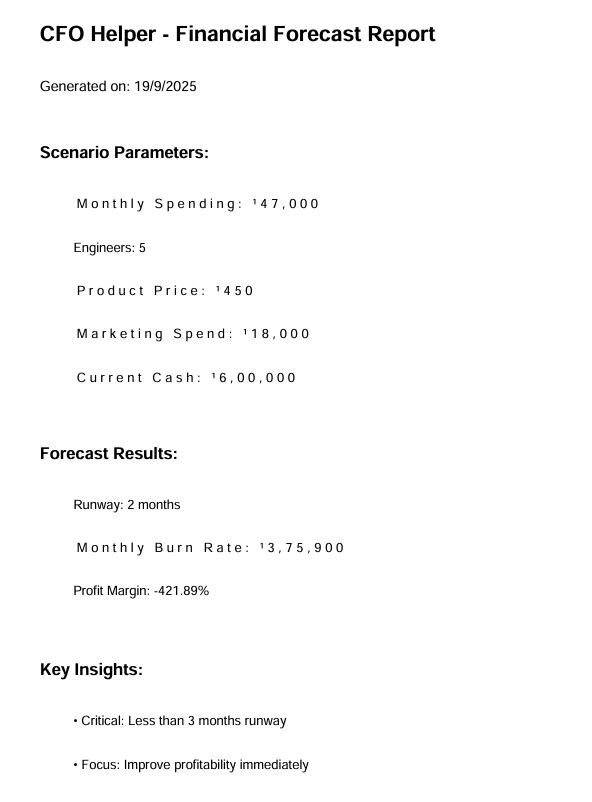

# 💰 **CFO Helper Agent**

A financial planning tool that helps startups and businesses simulate budget scenarios and forecast outcomes with interactive charts and AI-powered insights.

---

## 🚀 **Features**

### 🔹 **Core Functionality**
- **Interactive Sliders**: Adjust spending, hiring, pricing, and marketing budgets in real-time  
- **Financial Forecasting**: Get instant runway, burn rate, and profit margin calculations  
- **Visual Charts**: 6-month forecast with cash balance, revenue, and expense projections  
- **Scenario Simulation**: Test "what-if" scenarios with immediate feedback  

### 🔹 **Advanced Features**
- **PDF Report Export**: Generate professional reports with scenario details and insights  
- **Scenario Sharing**: Share scenarios via clipboard or native sharing  
- **Usage Tracking**: Monitor simulation and export counts  

---

## 🎯 **Use Cases**
- **Startup Founders**: "If I hire 2 more engineers, can I survive 6 months?"  
- **Event Organizers**: "If we spend ₹10,000 extra on marketing, what's left for prizes?"  
- **Business Owners**: "If I increase product price by 10%, what happens to profit?"  

---

## 🛠 **Technical Stack**
- **Frontend**: HTML5, CSS3 (Grid/Flexbox), Vanilla JavaScript  
- **Visualization**: Chart.js for interactive charts  
- **PDF Generation**: jsPDF for report exports  

---

## 📊 **Key Metrics Calculated**
1. **Runway**: How long your cash will last at current burn rate  
2. **Monthly Burn Rate**: Total monthly expenses minus revenue  
3. **Break-even Point**: Time to profitability  
4. **Profit Margin**: Revenue efficiency percentage
   
---

#  **screenshots**

  
  
  
  
  

---

